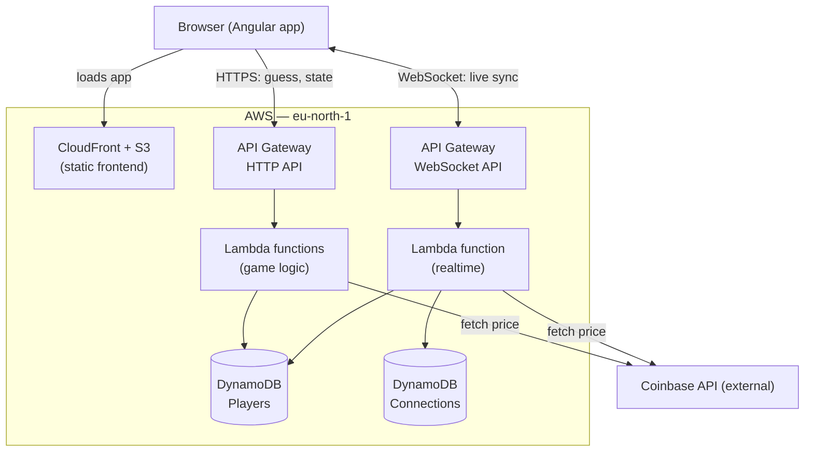

# BTC Up / Down

Guess whether the price of Bitcoin (BTC/USD) will be higher or lower in one minute. Correct guesses
score +1, wrong guesses score -1. Scores, streak, accuracy, and recent history persist per player —
close the tab and come back later and it's all still there. Updates push live over a WebSocket rather
than polling, so opening the same player in two tabs keeps them in sync instantly.

**Live app:** https://d1gnkq5pco145h.cloudfront.net
**API base URL:** https://mdpev870u4.execute-api.eu-north-1.amazonaws.com
**WebSocket URL:** wss://tz48f7xl5a.execute-api.eu-north-1.amazonaws.com/prod

## How it works

- **Identity, no login.** A random UUID in `localStorage` is the player ID — no signup, and your
  score/streak/history persist until you clear storage or switch device.
- **Placing a guess.** Click Up or Down — the backend fetches the entry price from Coinbase
  server-side, so the client can't fake it.
- **Resolution.** Resolves once 60+ seconds have passed **and** the price has moved. Checked lazily
  on every touch (guess, tick, or read) — no separate scheduler.
- **Live, synced across tabs.** A WebSocket tick every second keeps every open tab for a player in
  sync instantly; falls back to HTTP polling if the socket can't connect.
- **Fairness under concurrency.** DynamoDB conditional writes stop two simultaneous requests from
  both placing or both resolving the same guess.
- **History, streak, accuracy.** Last 10 results, streak, and win rate persist per player; a reset
  action clears stats but leaves a pending guess untouched.

## Architecture



Serverless on AWS, defined as infrastructure-as-code in `backend/template.yaml` (SAM/CloudFormation) —
one `sam deploy` builds it all.

- **HTTP API** → 3 Lambdas (Node 22) → DynamoDB: `GET /players/{id}`, `POST /players/{id}/guess`
  (`409` if one's pending), `POST /players/{id}/reset`
- **WebSocket API** → 1 Lambda, routes `$connect`/`$disconnect`/`subscribe`/`tick`. No DynamoDB
  Streams — whichever Lambda writes a change looks up subscribers (via a GSI) and pushes directly.
  Connections carry a TTL matching API Gateway's 2h socket lifetime.
- **DynamoDB**: `Players` (by `playerId`) and `Connections` (by `connectionId`, GSI on `playerId`),
  both on-demand
- **Price feed**: [Coinbase spot API](https://api.coinbase.com/v2/prices/BTC-USD/spot), server-side only
- **Frontend hosting**: S3 (private) behind CloudFront + Origin Access Control
- Region: `eu-north-1`

Frontend: Angular 22 (signals, zoneless) + Tailwind v4, light/dark theme toggle, no state library.

**Observability:** CloudWatch alarms → SNS topic (`AlarmTopicArn` in stack outputs).

## Running locally

Requires Node.js 22+, and either your own AWS backend deployed (see below) or the live one above.

```bash
cd frontend
npm install
npm start   # ng serve — http://localhost:4200
```

By default `environment.development.ts` points at the deployed API. To run the HTTP side fully
locally instead, point `apiBaseUrl` at `http://127.0.0.1:3000` and run the backend locally with SAM
(requires Docker):

```bash
cd backend
sam build
sam local start-api   # http://127.0.0.1:3000
```

`sam local` doesn't emulate WebSocket APIs, so `webSocketUrl` still needs to point at a real deployed
one (or be left broken) — the app's own fallback then just uses HTTP polling instead, which is exactly
the resilience path described above, not a special case to work around.

## Testing

```bash
cd backend && npm test    # Jest — 17 tests: resolution rules, scoring/streak/accuracy, history, concurrency
cd frontend && npm test   # Vitest — 19 tests: P&L calc, countdown timing, relative-time formatting
```

## Deploying your own copy

Requires the AWS CLI and SAM CLI configured with your own credentials (`aws configure`).

**1. Backend + infra:**

```bash
cd backend
sam build
sam deploy --guided   # first time: pick a stack name, region, allow IAM role creation
```

Note the `ApiUrl`, `WebSocketUrl`, `FrontendBucketName`, and `FrontendDistributionId` from the output.

**2. Frontend:**

Put your `ApiUrl` and `WebSocketUrl` into `frontend/src/environments/environment.ts` and
`environment.development.ts`, then:

```bash
cd frontend
npm install
npm run build
aws s3 sync dist/frontend/browser s3://<FrontendBucketName> --delete
aws cloudfront create-invalidation --distribution-id <FrontendDistributionId> --paths "/*"
```

Your app is now live at the CloudFront URL from the stack outputs (`FrontendUrl`).
